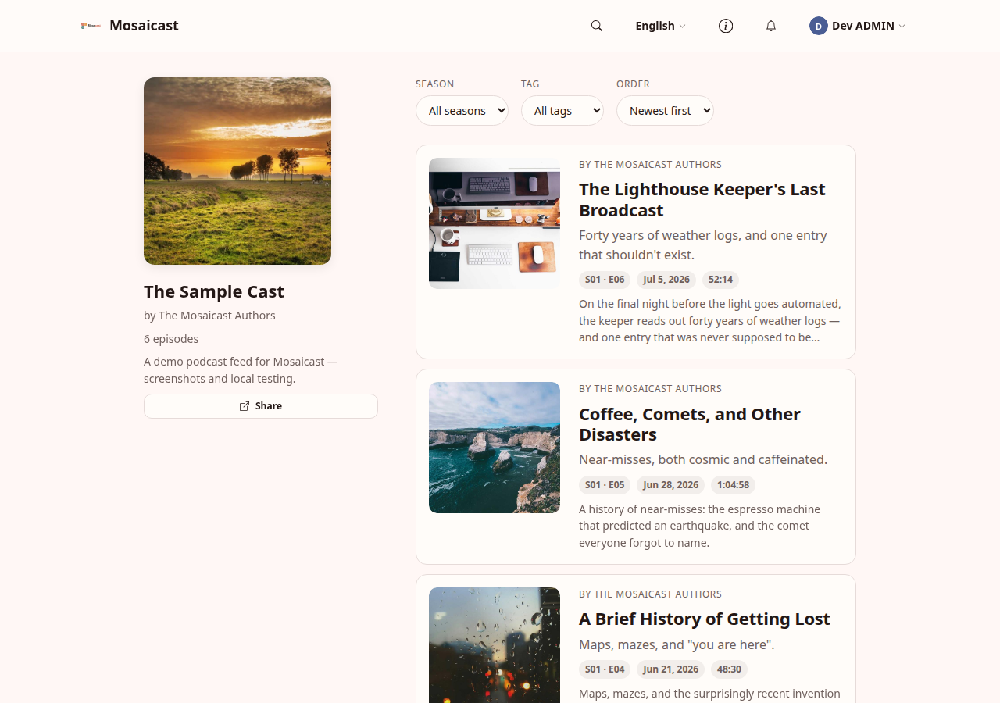
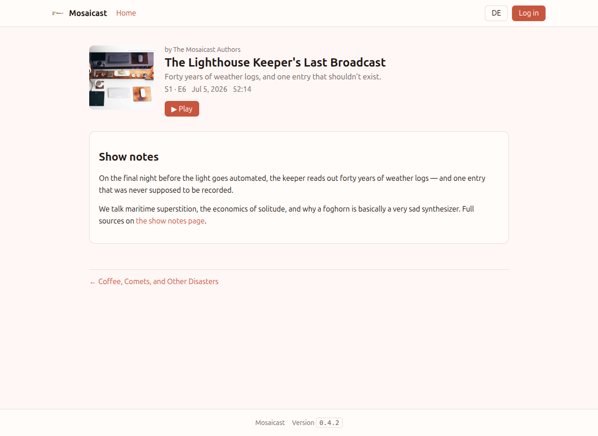
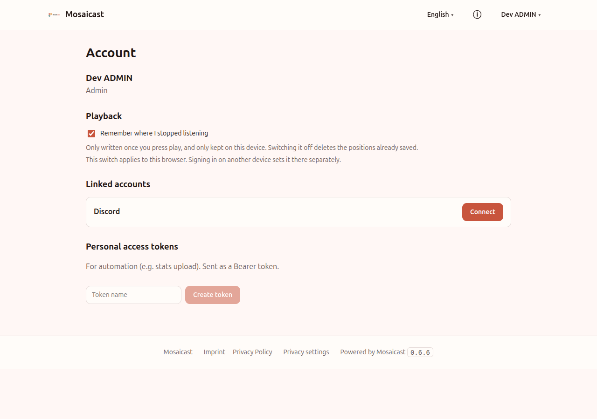
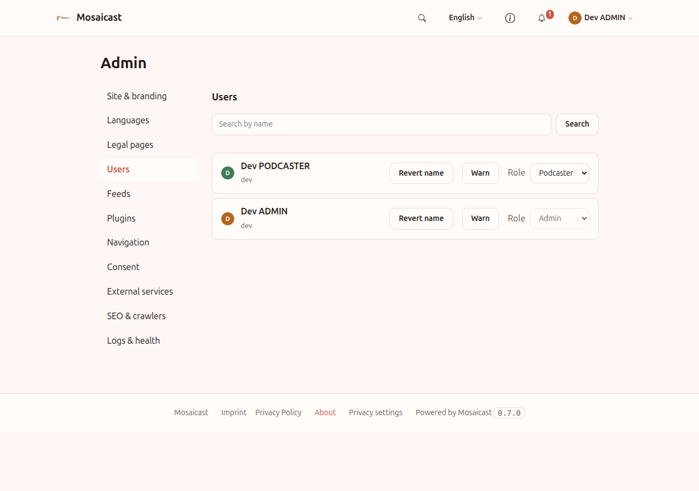

<p align="center">
  <picture>
    <source media="(prefers-color-scheme: dark)" srcset="assets/mosaicast-logo-dark.svg" />
    
  </picture>
</p>

<h1 align="center">mosaicast-core</h1>

> The host: Spring Boot backend + React/Vite shell. Loads plugins, unifies feeds, manages auth/branding/theming.

Part of **[Mosaicast](https://github.com/mosaicast)** — an extensible website platform for podcasts. Status: **v1 in development**.

## What is this?
See `docs/ARCHITECTURE.md` for the big picture and `docs/BRIEF.md` for this repo's scope.

## Screenshots

The unified episode feed (episodes are the centerpiece; feed / season / ordering are filters). The shell
themes from a single accent seed (OKLCH + WCAG clamp) — shown here in light and dark:

<p align="center">
  <picture>
    <source media="(prefers-color-scheme: dark)" srcset="assets/screenshots/home-dark.png" />
    
  </picture>
</p>

The episode detail page — hero with play, sanitized show notes, and fixed previous/next navigation:

<p align="center">
  <picture>
    <source media="(prefers-color-scheme: dark)" srcset="assets/screenshots/detail-dark.png" />
    
  </picture>
</p>

The account page — linked identities and personal access tokens:

<p align="center">
  <picture>
    <source media="(prefers-color-scheme: dark)" srcset="assets/screenshots/account-dark.png" />
    
  </picture>
</p>

The admin area — site name, theme mode, accent seed with live preview, and branding upload (Legal pages and
Feeds live behind the same role-gated nav):

<p align="center">
  <picture>
    <source media="(prefers-color-scheme: dark)" srcset="assets/screenshots/admin-dark.png" />
    
  </picture>
</p>

<sub>Screenshots use a fictional sample feed (`assets/sample/`), not any real podcast, and are captured
from the running shell during UI work — see the note in `CLAUDE.md`.</sub>

## Prerequisite: the plugin SDK

Core builds against the published **`@mosaicast/plugin-sdk`** — the TypeScript package on **npm** (public)
and the Java artifacts (`dev.mosaicast:plugin-api` / `plugin-testkit`) in **GitHub Packages**. Pin the
version in `gradle/libs.versions.toml` and `frontend/package.json` (currently `0.1.1`).

- **Frontend:** resolves from public npm — nothing extra, just `npm install`.
- **Backend:** GitHub Packages requires authentication even for reads. Either
  - set `gpr.user` / `gpr.key` in `~/.gradle/gradle.properties` (a PAT with `read:packages`), or export
    `GITHUB_ACTOR` / `GITHUB_TOKEN`; **or**
  - for offline/local work, publish the SDK to your Maven Local from the sibling repo
    (`../mosaicast-plugin-sdk`): `./gradlew publishToMavenLocal` — Gradle checks `mavenLocal()` first, so
    no token is needed.

## Build & test

```bash
./gradlew build            # backend: compile + unit + Testcontainers integration tests (needs Docker)

cd frontend
npm ci                     # installs @mosaicast/plugin-sdk from public npm
npm test                   # Vitest component tests
npm run build              # builds the shell into ../src/main/resources/static
```

> **Testcontainers + Docker Engine 29+:** the build pins the docker-java client API version (`api.version`
> system property, default `1.44`) and disables Ryuk in CI sandboxes. Override via `DOCKER_API_VERSION` /
> `TESTCONTAINERS_RYUK_DISABLED` if your daemon needs different values.

## Run locally

```bash
# 1) build the shell into static resources (see above): cd frontend && npm run build
# 2) start Postgres + the app:
cp .env.example .env              # fill in (DB password, Discord OAuth, bootstrap admin)
docker compose up --build         # → http://localhost:8080
# …or run the backend directly against a local Postgres:
./gradlew bootRun
```

### Dev profile & dev-login (local only)

`--spring.profiles.active=dev` enables developer conveniences, including (from M2) a **dev-login bypass**
that mints a session for any role **without Discord**. It exists **only** under the `dev` profile and is
structurally absent in production — never enable it on a deployed instance. The real Discord OAuth flow
needs real `DISCORD_CLIENT_ID`/`SECRET` and gets a one-time manual browser test at deployment.

The **Dockerfile** is multi-stage (Vite build → Gradle `bootJar` → slim JRE, shell baked in). The frontend
resolves the SDK from public npm; the backend needs a GitHub Packages token passed as a BuildKit secret —
see the header of `Dockerfile` for the `docker buildx build --secret …` invocation.
Plugins folder via `MOSAICAST_PLUGINS_DIR` (in the container `/app/plugins`, volume `./plugins`).
Layout reference for the shell: `docs/reference/mosaicast-mockup.jsx` (NOT the real architecture).

## Versioning & releases

- **Single source of truth:** the core version lives in **`gradle.properties`** (`version=…`). It is
  filtered into `build-metadata.properties` at build time, served at **`GET /api/meta`**, and shown in
  the shell next to the plugin SDK version. Nothing else sets it.
- **Scheme:** the minor version tracks the build milestone — **M1 = `0.1.x`, M2 = `0.2.x`**, … — and is
  independent of the plugin-contract (SDK) version. See [`CHANGELOG.md`](CHANGELOG.md).
- **Cutting a release:** bump `gradle.properties`, update `CHANGELOG.md`, then tag `vX.Y.Z` and publish a
  GitHub Release. `.github/workflows/release.yml` builds the image and pushes it to
  **`ghcr.io/mosaicast/mosaicast-core:X.Y.Z`** and `:latest` (the image's `/api/meta` version is stamped
  from the tag).

### Dev vs. production compose

- **Dev** — `docker-compose.yml` **builds** the image locally (needs the GitHub Packages token, above):
  ```bash
  docker compose up --build
  ```
- **Production** — `docker-compose.prod.yml` **pulls** the released image from GHCR (no build, no token):
  ```bash
  MOSAICAST_VERSION=0.1.0 docker compose -f docker-compose.prod.yml up -d   # omit to run :latest
  ```

## Plugins (E5)

The host loads plugins from **`MOSAICAST_PLUGINS_DIR`** (default `./plugins`) once at startup — no hot reload.
Each plugin is one folder holding a `plugin.json` manifest, a backend JAR (a PF4J extension of
`dev.mosaicast.plugin.api.PluginBackend`), and an `assets/` bundle, e.g.:

```
plugins/sample/
  plugin.json
  sample.jar          # the PF4J @Extension backend
  assets/sample.es.js # the frontend Web Component bundle
```

At boot the host validates each manifest (the declared `platformApi` must match the host's `0.4.x`; config
fields must be renderable), loads the JAR, and calls `register(ctx)`. A bad manifest, an incompatible
`platformApi`, a declared relational `schema` (the SDK has the surface since `0.4.0`; the host side is not built yet), or a thrown exception
**disables only that plugin** — it is recorded as rejected while the host keeps booting (ARCHITECTURE §7.8).
A plugin an admin switched off is skipped here entirely.

The frontend never calls plugin-authored routes; there are none. Instead the host exposes a fixed, generic,
per-plugin **doc-store** surface the plugin's Web Component reaches via `ctx.api`:

```
GET    /api/plugins/{id}/data/{scopeType}/{scopeId}/{key}      # one doc; 404 if absent
GET    /api/plugins/{id}/data/{scopeType}/{scopeId}?prefix=&page=&size=   # paginated list
PUT    /api/plugins/{id}/data/{scopeType}/{scopeId}/{key}      # upsert (last-write-wins)
DELETE /api/plugins/{id}/data/{scopeType}/{scopeId}/{key}      # idempotent
GET    /api/plugins/manifest                                   # public: active plugins' frontend + slots
GET    /plugins/{id}/assets/**                                 # the plugin's frontend bundle (ETagged)
GET    /p/{id}/**                                              # public: the plugin's deep-link page (+ OG tags)
GET    /api/consent                                            # public: services, storage and the fingerprint
GET    /api/admin/consent                                      # ADMIN: the same, attributed to plugins, + the CSP
GET    /api/admin/plugins                                      # ADMIN: discovered plugins, state, config, consent
PUT    /api/admin/plugins/{id}/enabled?value=                  # ADMIN: activation toggle
PUT    /api/admin/plugins/{id}/config                          # ADMIN + PODCASTER (per field `editableBy`)
POST   /api/admin/plugins/{id}/purge                           # ADMIN: delete the plugin's stored documents
```

Reads are gated by the plugin's least-privileged slot `visibleTo`; writes require a signed-in user at the
plugin's write floor (its least-privileged non-anonymous slot). Data is hard-scoped by plugin id — a plugin can
never see another's. To try a plugin: build it and drop its `dist/` into `MOSAICAST_PLUGINS_DIR/<id>/`, then
restart the host (the `mosaicast-plugin-sample` repo's `./build.sh` + `./install.sh` do this).

**Frontend (E5b):** the shell fetches the manifest, injects each plugin's bundle once, and mounts its Web
Components into the slot regions — matched by `placement` + scope, gated by `visibleTo`, stacked by `order`,
each in an error boundary. The host sets the SDK `PluginContext` on the element (scope, host-resolved
`episodes`, `user`, a namespaced `api` client, `locale`, `theme`, `consent`, and `route` on a deep-link page).

### Theming a plugin: the `--mc-*` tokens

The shell's design tokens are a **contract**, not private styling. CSS custom properties inherit across a
shadow boundary, so a plugin's Web Component can read every token below without asking for it — style
against them and your UI follows the site into dark mode, into an admin's accent, and into the visitor's
reduced-motion setting. Hard-coded colours do not.

| Group | Tokens |
|---|---|
| Colour | `--mc-bg` `--mc-surface` `--mc-text` `--mc-text-muted` `--mc-accent` `--mc-accent-contrast` `--mc-accent-2` `--mc-border` |
| Surface & state | `--mc-surface-2` `--mc-border-strong` `--mc-hover` `--mc-active` `--mc-accent-soft` `--mc-overlay` `--mc-focus` (+ `--mc-focus-width`, `--mc-focus-offset`) |
| Feedback | `--mc-danger` `--mc-danger-contrast` `--mc-success` `--mc-warning` |
| Space | `--mc-space-1` … `--mc-space-8` (0.25rem → 4rem) |
| Radius | `--mc-radius-sm` `--mc-radius-md` `--mc-radius-lg` `--mc-radius-pill` |
| Elevation | `--mc-shadow-1` `--mc-shadow-2` `--mc-shadow-3` |
| Type | `--mc-font-sans` `--mc-font-mono` `--mc-text-xs` … `--mc-text-3xl` `--mc-leading-tight` `--mc-leading-normal` `--mc-weight-medium` `--mc-weight-bold` |
| Motion | `--mc-motion-fast` `--mc-motion-base` `--mc-ease` |
| Layout | `--mc-container` `--mc-container-narrow` `--mc-player-height` |

Only the eight **colour** tokens also arrive as a JS object (`ctx.theme`, the SDK's `ThemeTokens`); the SDK's
`defineMosaicastElement` writes those onto your `:host`. Everything else is CSS-only — read it with `var()`,
not from `ctx`. The definitions, and the reasoning for which values are derived, live in
`frontend/src/styles/tokens.css`.

```css
:host {
  padding: var(--mc-space-4);
  border: 1px solid var(--mc-border);
  border-radius: var(--mc-radius-md);
  background: var(--mc-surface);
  box-shadow: var(--mc-shadow-1);
  transition: box-shadow var(--mc-motion-fast) var(--mc-ease);
}
```

### Configuring, switching off and purging a plugin (E5c)

**Admin → Plugins** lists every discovered plugin with its load state and, per plugin:

- a **config form generated from the manifest** — one input per declared field, its kind from the declared
  `type` (`string`, `number`, `boolean`), and **Reset** to drop back to the manifest default. Plugins never
  ship a config UI; a field the host cannot render is rejected at load. `editableBy` (`admin` | `podcaster`)
  decides who may set a field — the backend enforces it per field.
- an **activation toggle**. Switching a plugin off takes effect at once for everything the host mediates: it
  leaves `/api/plugins/manifest` (the shell unmounts it), its data API, assets and deep links 404, its
  scheduled tasks stop firing, and its doc-store **writes are refused** — which also stops a thread the plugin
  started itself. Its PF4J extension stays in process until the next restart, where the loader skips it
  entirely. Full containment needs that restart in any design (PF4J's own `stopPlugin` would not kill a
  plugin's threads either), and the UI says so rather than implying a kill switch.
- **Purge data** — deletes everything the plugin stored in the doc store. Deleting a plugin folder only makes
  it dormant; its data survives until this explicit action (§7.8). Configuration and on/off state are kept.

### Logs & health (Admin → Logs & health)

Everything the host logs about itself is also readable in the admin UI, so diagnosing a problem does not
require access to the container. A Logback appender captures core's own statements into the `app_log` table;
entries carry the area they came from, the plugin or feed they concern, and the stack trace where there is one.
Filter by level, area, plugin or text; expand a row for detail.

**Storing and showing are separate settings.** The store keeps **INFO and above** — the line before a failure
is usually what explains it — and the dev profile lowers that to `DEBUG`. The viewer *opens* at **WARN and
above** so routine chatter is not in the way, one dropdown from the rest. A level filter always means "that
level and above", so a view set to WARN never hides an error. Change what is stored with
`mosaicast.log.capture-level`.

The health card at the top answers *is anything broken right now?* — each plugin's state **with the reason it
was rejected**, each feed's poll state **with its last error**, and error/warning counts for the last 24 hours.

Plugins report their own trouble via `POST /api/plugins/{id}/log` (signed-in user at the plugin's write floor,
size-capped and rate-limited). Tune retention and capture with `mosaicast.log.*` — see `application.yml`.

### Deep links, sharing and the sitemap (E5c)

The host reserves **`/p/{pluginId}/*`**. A plugin that declares a slot at the `page` placement renders there
at site scope and receives the subpath as `ctx.route`, which is what makes plugin content linkable. Because
link scrapers run no JS, the server answers those URLs itself with OpenGraph/Twitter tags from the plugin's
optional `ShareMetadataProvider`, falling back to site metadata; an unknown or switched-off plugin gets a real
404. `GET /sitemap.xml` lists episodes, feed views and legal pages plus each active plugin's `SitemapProvider`
entries, validated to sit under that plugin's own `/p/{id}/` namespace.

### Consent (E5d)

The core stores only what the requested service needs — session, CSRF token, language, cached branding, the
consent decision itself — so **it runs banner-free**. A visitor is asked something only because a plugin
declared a third-party service in `consent.services[]`: a name, the **company** operating it, a category, a
privacy URL, the origins it is contacted on, whether data leaves the EU/EEA, and every item it stores with a
purpose and a lifetime.

What visitors see is generated from those declarations and **never mentions plugins** — they decide about
services and companies, not about the site's architecture. Allow and refuse carry identical weight on the
first layer. The host knows `necessary` (never asked about), `functional` and `analytics`; any other string
passes through as a plugin-declared category, shown under its own name.

**The settings are one component in three places** — `/cookies`, appended below the legal page marked
`privacy`, and inside the banner — because withdrawal has to be as easy as granting. The footer link is
unconditional: even with no plugin installed, the core's own storage is disclosed there and the
playback-position switch lives there. Decisions are per category, stored in `localStorage` as a receipt the
visitor can read and export (`decidedAt`, the declaration fingerprint, the per-category answer), and reach
plugins as `ctx.consent.has(category)`, which **denies by default**.

A stored answer stops counting when the **declaration changes** (the server's fingerprint moves, so a newly
installed service cannot inherit consent given before it existed), after **twelve months**, or when the
browser sends **Global Privacy Control** — which is honoured as a refusal without showing a banner, and can
still be overridden in the settings. Nothing about who consented is stored server-side; **Admin → Consent**
shows the operator's half instead: every declared service attributed to its plugin, the resulting CSP
allow-list, and the fingerprint.

The same declaration is the permission: the CSP is widened by exactly the declared `hosts`
(`script-src`/`frame-src`/`connect-src`) of active plugins, so an undeclared third party stays blocked even
with consent given, and switching a plugin off narrows the policy again.

**Feeds and episodes are both addressed by a public slug** (§4.1) — stable, human-readable ids
(`the-sample-cast`, `the-sample-cast-s01e06`) used in `/feeds/{slug}` and `/episodes/{slug}`, in the API, and,
for plugins, in `ctx.episodes` and the `feed` / `season` / `episode` `scope.id` (so a plugin's
`data/feed/{slug}/…` matches the URL). The UUID stays the internal key (listening progress, audio, episode
filters). Slugs are minted **once at creation and never change**, because a feed title moves on any poll and
re-slugging would break shared links and orphan plugin data. Feed URLs were UUID-shaped before `0.5.12`, so
the API still resolves a feed UUID; existing plugin documents are moved to the new scope ids at boot.
Plugins get `ctx.episodeLabels` (`S01E06 · <title>`) so pickers show titles, not ids.

## Project layout

```
src/main/java/dev/mosaicast/core/
  episode/   EpisodeRef identity + display snapshot, read/search API (ARCHITECTURE §4, §6)
  feed/      FeedSource SPI, RssFeedSource, reconciler, ShedLock scheduler, admin API (§5)
  auth/      User + LinkedIdentity, Discord oauth2Login, merging rules, /api/me, PATs (§8)
  plugin/    PF4J loading, PluginContext (doc store / feeds / config / onSchedule), /api/plugins surface (§7)
  config/    security (oauth2/session/CSRF/RBAC), headers, scheduling/ShedLock
  web/       SPA serving, RFC 7807 handling, pagination envelope
src/main/resources/
  db/migration/   Flyway migrations (schema is Flyway-only)
  branding/       default logo/mark fallback (§12)
  static/         built shell bundle (generated by the frontend build; gitignored)
test-fixtures/sample-plugin/   a tiny real plugin JAR, compiled for the plugin-loading integration test
frontend/    React/Vite host shell (built into resources/static)
  src/styles.css   the @import manifest; every rule lives in src/styles/*.css
  src/styles/tokens.css   the --mc-* design tokens plugins inherit (§12.3)
```

Key API: `POST /api/admin/feeds` (add + preview + refresh, **PODCASTER/ADMIN**),
`GET /api/admin/feeds/{id}/suggestions` + `POST …/suggestions/{id}/confirm` + `DELETE …/suggestions/{id}`
(review/confirm/dismiss fuzzy PLANNED bindings, §5.3, **PODCASTER/ADMIN**),
`GET /api/feeds` (public catalog), `GET /api/feeds/{slug}` (feed detail for the panel),
`GET /api/episodes?feedId=&season=&tag=&order=` (unified site-scope feed),
`GET /api/tags?feedId=` (tag filter options), `GET /api/feeds/{slug}/episodes?season=`,
`GET /api/feeds/{slug}/seasons`, `GET /api/episodes/{id}`, `GET /api/episodes/{id}/adjacent`,
`GET /api/episodes/search?q=` (public read); `GET /api/me`, `GET/DELETE /api/me/identities`,
`GET/POST/DELETE /api/me/tokens`, `GET/PUT /api/me/progress` (authenticated). All lists paginate; errors are
`application/problem+json`.

**Auth (§8):** Discord `oauth2Login` (active only when `DISCORD_CLIENT_ID`/`SECRET` are set), server-side
cookie sessions (no JWT), CSRF via the `XSRF-TOKEN` cookie (SPA sends it back as `X-XSRF-TOKEN`), and
RBAC (ADMIN/PODCASTER/FAN). Automation uses **personal access tokens** as `Authorization: Bearer …`. The
bootstrap admin is set via `ADMIN_BOOTSTRAP_PROVIDER`/`ADMIN_BOOTSTRAP_EXTERNAL_ID`. Locally, the `dev`
profile's `POST /api/auth/dev-login?role=…` mints a session for any role without Discord.

**Social login needs a secure context.** The session cookie is `Secure` by default, so the OAuth round-trip
only works over **HTTPS** or **`http://localhost`** (browsers special-case localhost). Over plain http on a
LAN IP / hostname (e.g. `http://192.168.x.x:8080`) the browser silently drops the cookie and login fails
with `authorization_request_not_found` — the shell shows a generic "Login failed." Options:

- **Production:** put a TLS-terminating reverse proxy in front (your choice — none is baked into compose)
  and set `MOSAICAST_BASE_URL=https://yourdomain`. The app honors `X-Forwarded-Proto`/`Host`
  (`server.forward-headers-strategy: framework`), so the Discord redirect URI resolves to `https://…`.
- **Plain-http local run:** set `MOSAICAST_SECURITY_SECURE_COOKIE=false` (see `.env.example`). Never do this
  on a real deployment. Also register the matching redirect URI (`<MOSAICAST_BASE_URL>/login/oauth2/code/discord`)
  in the Discord portal.

## Branding assets

The Mosaicast logo and mark ship as the **default branding**, used until an admin uploads custom
branding (ARCHITECTURE §12.1). Accent `#C8553D` matches the default theme seed.

| File | Role |
|---|---|
| `docs/brand/mosaicast-logo.svg` | Design source — full logo (mark + wordmark, light background) |
| `docs/brand/mosaicast-mark.svg` | Design source — square mark (theme-safe on light & dark) |
| `frontend/public/brand/*.svg` | Runtime copies the shell serves: **favicon** and the header **mark** |
| `src/main/resources/branding/*.svg` | Backend default fallback served by `/branding/logo`·`/branding/favicon` (M3) when `SiteConfig` has no custom asset |

The full logo's wordmark uses a dark ink that is only legible on a light background, so the **mark** is
used wherever the theme may be dark (header, favicon). Replace all copies together if the artwork changes.

## Contributing
Contributions welcome — see [`CONTRIBUTING.md`](CONTRIBUTING.md). In short: `git commit -s` (DCO, required), SPDX header in new files, add tests.

## License
**GNU Affero General Public License v3.0 or later** — see [`LICENSE`](LICENSE). Header per source file:
```
// SPDX-License-Identifier: AGPL-3.0-or-later
// SPDX-FileCopyrightText: 2026 The Mosaicast Authors
```

## Name & trademark
"Mosaicast" and the logo denote the official project. Please rename forks.
